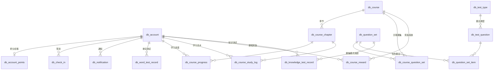

# 数据库说明

本文档说明 LearningProgram 的 MySQL 数据库结构：表清单、表间关系、字段定义和维护约定。接口行为见 [API.md](./API.md)，环境搭建见 [INSTALLATION.md](./INSTALLATION.md)。

## 概述

- 数据库：MySQL 8.0+，库名默认 `learning`，字符集 `utf8mb4`。
- 所有表使用 InnoDB 引擎、`db_` 前缀命名，主键为 `AUTO_INCREMENT` 的 `id`。
- MyBatis-Plus 按驼峰 ↔ 下划线自动映射（如 `register_time` ↔ `registerTime`），个别字段用 `@TableField` 显式指定。
- 用户密码保存 BCrypt 密文，字段长度 `VARCHAR(255)`。
- 迁移脚本位于 `learning-program-backend/src/main/resources/db/migration/`，项目未启用 Flyway 自动执行，升级已有数据库时需按序号手工执行。

## 表清单

| 分组 | 表名 | 用途 |
| --- | --- | --- |
| 账号与积分 | `db_account` | 用户账号 |
| 账号与积分 | `db_account_points` | 积分总账（每用户一行） |
| 账号与积分 | `db_check_in` | 每日签到记录 |
| 账号与积分 | `db_notification` | 站内通知 |
| 课程与学习 | `db_course` | 课程 |
| 课程与学习 | `db_course_chapter` | 课程章节（Markdown 正文） |
| 课程与学习 | `db_course_question_set` | 课程 ↔ 题集关联 |
| 课程与学习 | `db_course_progress` | 章节粒度的学习进度 |
| 课程与学习 | `db_course_study_log` | 每次学习上报的流水 |
| 课程与学习 | `db_course_reward` | 完成课程的积分发放记录 |
| 题库与测试 | `db_test_type` | 题目类型 |
| 题库与测试 | `db_test_question` | 题库题目 |
| 题库与测试 | `db_question_set` | 题集 |
| 题库与测试 | `db_question_set_item` | 题集 ↔ 题目关联 |
| 题库与测试 | `db_knowledge_test_record` | 知识测试成绩记录 |
| 题库与测试 | `db_word_test_record` | 单词测试成绩记录 |
| 词典与资源 | `db_dictionary` | 英文词典（word ↔ translation） |
| 词典与资源 | `db_cet4` / `db_cet6` | CET4 / CET6 词表 |
| 词典与资源 | `db_learning_resource` | 学习资源文件元信息 |

## 实体关系

级联删除链：删除 `db_course` 会级联删除其章节、题集关联和奖励记录；章节删除会级联删除对应的学习进度与流水；删除 `db_account` 会级联删除通知、签到、积分总账和测试记录。例外：`db_learning_resource.account_id` 是不带外键的软引用，删除账号后资源的“上传者”显示为空。

## 账号与积分

### db_account 用户账号

| 字段 | 类型 | 约束 | 说明 |
| --- | --- | --- | --- |
| id | INT | PK, AUTO_INCREMENT | |
| username | VARCHAR(32) | NOT NULL, UNIQUE | 用户名，登录凭据之一 |
| password | VARCHAR(255) | NOT NULL | BCrypt 密文 |
| email | VARCHAR(128) | NOT NULL, UNIQUE | 邮箱，登录凭据之一 |
| role | VARCHAR(32) | NOT NULL DEFAULT 'user' | `user` / `admin` |
| register_time | DATETIME | NOT NULL, DEFAULT CURRENT_TIMESTAMP | 注册时间 |
| phone | VARCHAR(30) | NULL | 手机号 |
| bio | VARCHAR(120) | NULL | 个人简介 |
| points | INT | NOT NULL DEFAULT 0 | 早期遗留字段，注册时固定写 0；有效积分以 `db_account_points` 为准 |

### db_account_points 积分总账

积分的唯一权威来源。签到（`db_check_in`）与完成课程奖励（`db_course_reward`）通过 `addPoints` 累加到 `total_points`。

| 字段 | 类型 | 约束 | 说明 |
| --- | --- | --- | --- |
| id | INT | PK, AUTO_INCREMENT | |
| account_id | INT | NOT NULL, UNIQUE, FK → db_account(id) | 每用户一行 |
| total_points | INT | NOT NULL DEFAULT 0 | 当前总积分 |

### db_check_in 每日签到

| 字段 | 类型 | 约束 | 说明 |
| --- | --- | --- | --- |
| id | INT | PK, AUTO_INCREMENT | |
| account_id | INT | NOT NULL, FK → db_account(id) | |
| checkin_date | DATE | NOT NULL | 签到日；`(account_id, checkin_date)` 唯一，一天一次 |
| points | INT | NOT NULL | 本次签到获得积分 |
| streak | INT | NOT NULL | 连续签到天数 |

### db_notification 站内通知

| 字段 | 类型 | 约束 | 说明 |
| --- | --- | --- | --- |
| id | INT | PK, AUTO_INCREMENT | |
| account_id | INT | NOT NULL, FK → db_account(id) ON DELETE CASCADE | 收件人 |
| title | VARCHAR(128) | NOT NULL | |
| content | VARCHAR(1000) | NOT NULL | |
| type | VARCHAR(32) | NOT NULL DEFAULT 'system' | 通知类型，当前均为 `system` |
| is_read | TINYINT(1) | NOT NULL DEFAULT 0 | 已读标记 |
| created_at | DATETIME | NOT NULL, DEFAULT CURRENT_TIMESTAMP | |

## 课程与学习

课程完成的判定：学员学完课程内全部章节（`db_course_progress` 覆盖全部章节）。

### db_course 课程

| 字段 | 类型 | 约束 | 说明 |
| --- | --- | --- | --- |
| id | INT | PK, AUTO_INCREMENT | |
| title | VARCHAR(100) | NOT NULL | |
| description | VARCHAR(500) | NULL | |
| icon | VARCHAR(16) | NULL | emoji 字符 |
| sort_order | INT | NOT NULL DEFAULT 0 | 学员端卡片展示顺序 |
| reward_points | INT | NOT NULL DEFAULT 0 | 完成奖励积分，0 表示不奖励 |
| created_at | DATETIME | NOT NULL | |

### db_course_chapter 课程章节

| 字段 | 类型 | 约束 | 说明 |
| --- | --- | --- | --- |
| id | INT | PK, AUTO_INCREMENT | |
| course_id | INT | NOT NULL, FK → db_course(id) ON DELETE CASCADE | |
| title | VARCHAR(150) | NOT NULL | |
| content | MEDIUMTEXT | NULL | 章节正文，支持 Markdown |
| sort_order | INT | NOT NULL DEFAULT 0 | 章节顺序 |
| created_at | DATETIME | NOT NULL | |

### db_course_question_set 课程 ↔ 题集关联

| 字段 | 类型 | 约束 | 说明 |
| --- | --- | --- | --- |
| id | INT | PK, AUTO_INCREMENT | |
| course_id | INT | NOT NULL, FK → db_course(id) ON DELETE CASCADE | |
| set_id | INT | NOT NULL, FK → db_question_set(id) ON DELETE CASCADE | |
| sort_order | INT | NOT NULL DEFAULT 0 | 课程内顺序 |
| created_at | DATETIME | NOT NULL | |

`(course_id, set_id)` 唯一。

### db_course_progress 章节学习进度

| 字段 | 类型 | 约束 | 说明 |
| --- | --- | --- | --- |
| id | INT | PK, AUTO_INCREMENT | |
| account_id | INT | NOT NULL | 与 `chapter_id` 组成唯一键，一章一进度 |
| course_id | INT | NOT NULL | 冗余存储便于统计 |
| chapter_id | INT | NOT NULL, FK → db_course_chapter(id) ON DELETE CASCADE | |
| duration_seconds | INT | NOT NULL DEFAULT 0 | 该章累计学习时长 |
| studied_count | INT | NOT NULL DEFAULT 1 | 该章被标记已学的次数 |
| created_at / updated_at | DATETIME | NOT NULL | |

### db_course_study_log 学习流水

每次上报追加一行，本周学习时长按 `created_at` 汇总，避免累计值被重复计入。

| 字段 | 类型 | 约束 | 说明 |
| --- | --- | --- | --- |
| id | INT | PK, AUTO_INCREMENT | |
| account_id | INT | NOT NULL | |
| course_id | INT | NOT NULL | 冗余存储 |
| chapter_id | INT | NOT NULL, FK → db_course_chapter(id) ON DELETE CASCADE | |
| duration_seconds | INT | NOT NULL | 本次时长（上限 3600 秒） |
| created_at | DATETIME | NOT NULL | 索引 `(account_id, created_at)` 支撑周统计 |

### db_course_reward 完成课程积分发放记录

| 字段 | 类型 | 约束 | 说明 |
| --- | --- | --- | --- |
| id | INT | PK, AUTO_INCREMENT | |
| account_id | INT | NOT NULL | 与 `course_id` 组成唯一键，保证每门课程的奖励只发放一次 |
| course_id | INT | NOT NULL, FK → db_course(id) ON DELETE CASCADE | |
| points | INT | NOT NULL | 发放时的积分数 |
| created_at | DATETIME | NOT NULL | |

课程奖励调整后只影响之后完成课程的学员，已发放的记录不补发或追回。

## 题库与测试

### db_test_type 题目类型

| 字段 | 类型 | 约束 | 说明 |
| --- | --- | --- | --- |
| id | INT | PK, AUTO_INCREMENT | |
| code | VARCHAR(50) | NOT NULL, UNIQUE | 类型编码 |
| name | VARCHAR(100) | NOT NULL | 类型名称 |
| description | VARCHAR(255) | NULL | |
| created_at | DATETIME | NOT NULL | |

### db_test_question 题库题目

| 字段 | 类型 | 约束 | 说明 |
| --- | --- | --- | --- |
| id | INT | PK, AUTO_INCREMENT | |
| type_id | INT | NOT NULL, FK → db_test_type(id) | |
| kind | VARCHAR(20) | NOT NULL | `single` 单选 / `multiple` 多选 / `blank` 填空 |
| content | LONGTEXT (JSON, CHECK json_valid) | NOT NULL | 题干、选项、答案与解析的 JSON |
| created_at | DATETIME | NOT NULL | |

索引 `(type_id, kind)` 支撑按类型和题型筛选。

### db_question_set 题集

| 字段 | 类型 | 约束 | 说明 |
| --- | --- | --- | --- |
| id | INT | PK, AUTO_INCREMENT | |
| title | VARCHAR(100) | NOT NULL | |
| description | VARCHAR(255) | NULL | |
| created_at | DATETIME | NOT NULL | |

### db_question_set_item 题集 ↔ 题目关联

| 字段 | 类型 | 约束 | 说明 |
| --- | --- | --- | --- |
| id | INT | PK, AUTO_INCREMENT | |
| set_id | INT | NOT NULL, FK → db_question_set(id) ON DELETE CASCADE | |
| question_id | INT | NOT NULL, FK → db_test_question(id) | |

`(set_id, question_id)` 唯一；删除题目不级联删除关联项，需先自行清理。

### db_knowledge_test_record 知识测试成绩

| 字段 | 类型 | 约束 | 说明 |
| --- | --- | --- | --- |
| id | INT | PK, AUTO_INCREMENT | |
| account_id | INT | NOT NULL | 不带外键，索引 `(account_id, created_at)` |
| type_id | INT | NULL | 类型模式下的题目类型；题集模式下为空。曾经的外键已随 V12 迁移移除 |
| type_name | VARCHAR(100) | NOT NULL | 类型名快照；题集模式下为「题集：{title}」 |
| set_id | INT | NULL, FK → db_question_set(id) | 题集模式下的题集 |
| total_count / correct_count / wrong_count | INT | NOT NULL | 答题统计 |
| score | INT | NOT NULL | 得分 |
| duration_seconds | INT | NOT NULL | 用时 |
| detail | LONGTEXT (JSON, CHECK json_valid) | NULL | 答题明细，结构见迁移脚本 V8 注释 |
| created_at | DATETIME | NOT NULL | |

### db_word_test_record 单词测试成绩

| 字段 | 类型 | 约束 | 说明 |
| --- | --- | --- | --- |
| id | INT | PK, AUTO_INCREMENT | |
| account_id | INT | NOT NULL, FK → db_account(id) | |
| source | VARCHAR(10) | NOT NULL | 词表来源 `cet4` / `cet6` |
| total_count / correct_count / wrong_count | INT | NOT NULL | 答题统计 |
| score | INT | NOT NULL | 得分 |
| duration_seconds | INT | NOT NULL DEFAULT 0 | 用时 |
| created_at | DATETIME | NOT NULL | |

## 词典与资源

### db_dictionary / db_cet4 / db_cet6 词表

三张表结构相同：`id`（PK）、`word` VARCHAR(255) NOT NULL、`translation`（db_dictionary 为 TEXT，其余为 VARCHAR(512)）。`db_dictionary` 供查词使用，`db_cet4` / `db_cet6` 作为每日一词和单词测试的词库来源。

### db_learning_resource 学习资源

| 字段 | 类型 | 约束 | 说明 |
| --- | --- | --- | --- |
| id | INT | PK, AUTO_INCREMENT | |
| title | VARCHAR(100) | NOT NULL | |
| description | VARCHAR(255) | NULL | |
| file_name | VARCHAR(255) | NOT NULL | 原始文件名 |
| stored_name | VARCHAR(100) | NOT NULL | 磁盘存储名（对应 `learning.resources.upload-dir`） |
| content_type | VARCHAR(100) | NULL | MIME 类型 |
| file_size | BIGINT | NOT NULL DEFAULT 0 | 字节数，单个上限 50MB |
| visible | TINYINT(1) | NOT NULL DEFAULT 1 | 是否在学员端展示 |
| account_id | INT | NULL | 上传者，软引用 db_account，不带外键 |
| created_at | DATETIME | NOT NULL | 索引 `(visible, created_at)` |

## 迁移脚本

`learning-program-backend/src/main/resources/db/migration/` 中的脚本按序号递增，未启用 Flyway，需手工执行：

| 脚本 | 内容 |
| --- | --- |
| V7 | 题库表：`db_test_type`、`db_test_question` |
| V8 | 知识测试记录 `db_knowledge_test_record`（含 `detail` JSON 结构说明） |
| V9 | 题集表：`db_question_set`、`db_question_set_item` |
| V10 | 学习进度 `db_course_progress`、学习流水 `db_course_study_log` |
| V11 | 课程表：`db_course`、`db_course_chapter`、`db_course_question_set` |
| V12 | 知识测试支持课程题集模式（`type_id` 允许 NULL 并移除其外键） |
| V13 | 学习资源 `db_learning_resource` |
| V14 | 课程奖励积分：`db_course.reward_points` 列 + `db_course_reward` 表 |

V1–V6（账号、通知、签到、积分、词典等基础表）未纳入仓库，其结构见本文档各表定义与 [INSTALLATION.md](./INSTALLATION.md) 的建表语句；新建环境时可以按“表清单”一节逐表创建，已有环境升级时执行缺失的迁移脚本即可。
